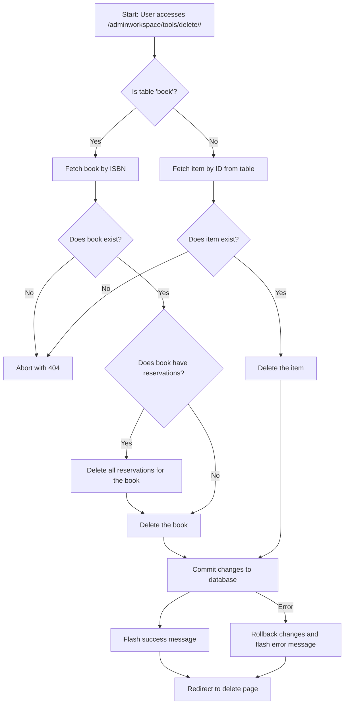

```mermaid
flowchart TD
    A[Start: User accesses /adminworkspace/tools/delete/<table>/<voorwerp_id>] --> B{Is table 'boek'?}
    B -- Yes --> C[Fetch book by ISBN]
    C --> D{Does book exist?}
    D -- No --> E[Abort with 404]
    D -- Yes --> F{Does book have reservations?}
    F -- Yes --> G[Delete all reservations for the book]
    G --> H[Delete the book]
    F -- No --> H
    H --> I[Commit changes to database]
    I --> J[Flash success message]
    I -- Error --> K[Rollback changes and flash error message]
    J --> L[Redirect to delete page]
    K --> L
    B -- No --> M[Fetch item by ID from table]
    M --> N{Does item exist?}
    N -- No --> E
    N -- Yes --> O[Delete the item]
    O --> I
```
