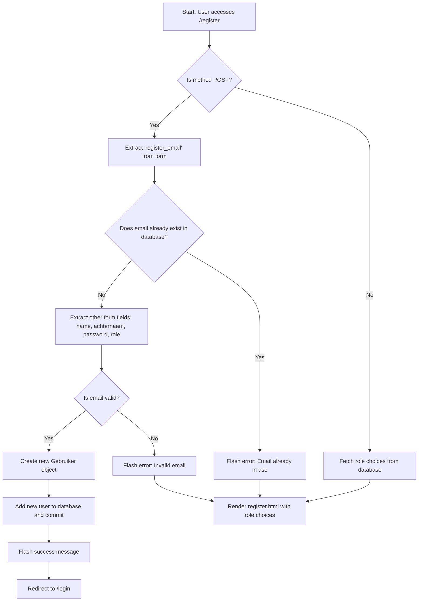

```mermaid
flowchart TD
    A[Start: User accesses /register] --> B{Is method POST?}
    B -- Yes --> C[Extract 'register_email' from form]
    C --> D{Does email already exist in database?}
    D -- No --> E[Extract other form fields: name, achternaam, password, role]
    E --> F{Is email valid?}
    F -- Yes --> G[Create new Gebruiker object]
    G --> H[Add new user to database and commit]
    H --> I[Flash success message]
    I --> J[Redirect to /login]
    F -- No --> K[Flash error: Invalid email]
    K --> L[Render register.html with role choices]
    D -- Yes --> M[Flash error: Email already in use]
    M --> L
    B -- No --> N[Fetch role choices from database]
    N --> L[Render register.html with role choices]
```
