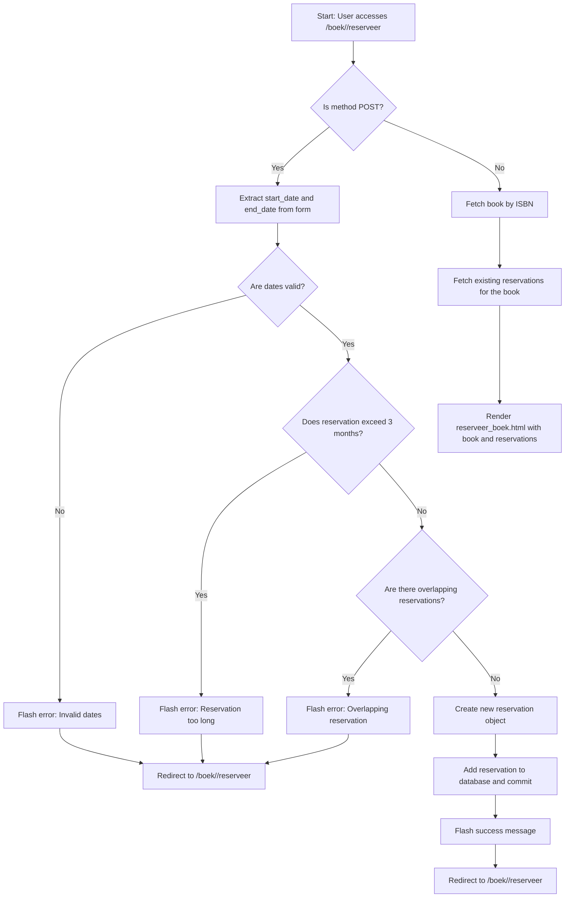

```mermaid
flowchart TD
    A[Start: User accesses /boek/<ISBN>/reserveer] --> B{Is method POST?}
    B -- Yes --> C[Extract start_date and end_date from form]
    C --> D{Are dates valid?}
    D -- No --> E[Flash error: Invalid dates]
    E --> F[Redirect to /boek/<ISBN>/reserveer]
    D -- Yes --> G{Does reservation exceed 3 months?}
    G -- Yes --> H[Flash error: Reservation too long]
    H --> F
    G -- No --> I{Are there overlapping reservations?}
    I -- Yes --> J[Flash error: Overlapping reservation]
    J --> F
    I -- No --> K[Create new reservation object]
    K --> L[Add reservation to database and commit]
    L --> M[Flash success message]
    M --> N[Redirect to /boek/<ISBN>/reserveer]
    B -- No --> O[Fetch book by ISBN]
    O --> P[Fetch existing reservations for the book]
    P --> Q[Render reserveer_boek.html with book and reservations]
```
