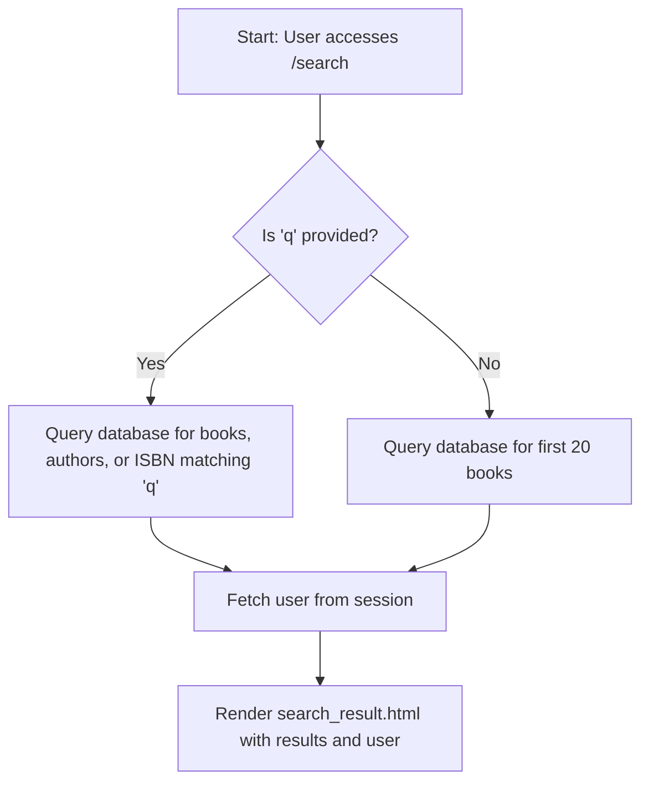

```mermaid
flowchart TD
    A[Start: User accesses /search] --> B{Is 'q' provided?}
    B -- Yes --> C[Query database for books, authors, or ISBN matching 'q']
    B -- No --> D[Query database for first 20 books]
    C --> E[Fetch user from session]
    D --> E
    E --> F[Render search_result.html with results and user]
```
