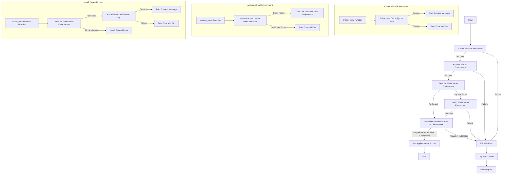

```mermaid
graph TD
    A[Start] --> B[Create Virtual Environment]
    B -->|Success| C[Activate Virtual Environment]
    B -->|Failure| G[Exit with Error]
    C -->|Success| D[Check for Pip in Virtual Environment]
    C -->|Failure| G
    D -->|Pip Found| F[Install Dependencies from requirements.txt]
    D -->|Pip Not Found| E[Install Pip in Virtual Environment]
    E -->|Success| F
    E -->|Failure| G
    F -->|Dependencies Installed Successfully| H[Run Application or Scripts]
    F -->|Failure in Installation| G
    H --> I[End]
    G --> J[Log Error Details]
    J --> K[Exit Program]

    subgraph "Create Virtual Environment"
        B1[create_venv Function] --> B2[Subprocess Call to Python venv]
        B2 -->|Success| B3[Print Success Message]
        B2 -->|Failure| B4[Print Error and Exit]
    end

    subgraph "Activate Virtual Environment"
        C1[activate_venv Function] --> C2[Check OS and Locate Activation Script]
        C2 -->|Script Found| C3[Simulate Activation with Subprocess]
        C2 -->|Script Not Found| C4[Print Error and Exit]
    end

    subgraph "Install Dependencies"
        F1[install_dependencies Function] --> F2[Check for Pip in Virtual Environment]
        F2 -->|Pip Found| F3[Install Dependencies with Pip]
        F2 -->|Pip Not Found| F4[Install Pip and Retry]
        F3 -->|Success| F5[Print Success Message]
        F3 -->|Failure| F6[Print Error and Exit]
    end
```
